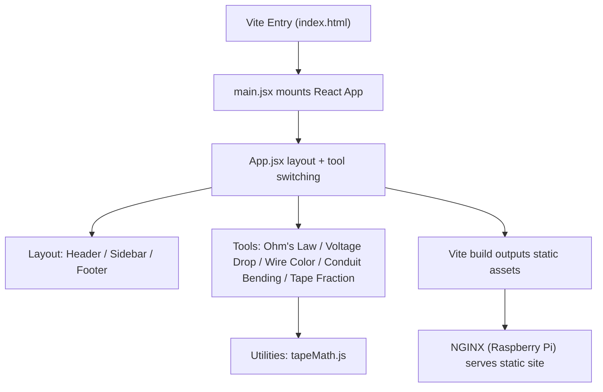

# Electrician Toolkit (React + Vite)

A collection of practical tools built for electricians and apprentices.

Built with React + Vite. Styling matches my main site at **joeyoyong.com**.

Field focus:
- Tape-measure-friendly inputs
- Results rounded to the nearest 1/16
- Output formatting that matches jobsite workflow

---

## Tools Included

- **Ohm’s Law Calculator**
- **Voltage Drop Calculator**
- **Wire Color Guide**
- **Conduit Bending Tool**
  - 2-Bend Offset
  - Rolling Offset
  - Tape-friendly inputs (`4 1/4`, `5-7/8`, `10' 2 3/16"`)
  - Results rounded to nearest 1/16
- **Tape Fraction Calculator**
  - Add, subtract, normalize tape measurements
  - Outputs rounded to nearest 1/16

---

## Architecture

Tech Stack
React (Vite)

JavaScript (ES6+)

Plain CSS (shared design system)

Component-based architecture

Static build served via NGINX

Project Structure
text
Copy code
electrician-toolkit/
├── index.html
├── package.json
├── vite.config.js
├── public/
│   └── vite.svg
└── src/
    ├── main.jsx
    ├── App.jsx
    ├── styles/
    │   ├── globals.css
    │   └── layout.css
    ├── components/
    │   └── layout/
    │       ├── Header.jsx
    │       ├── Sidebar.jsx
    │       └── Footer.jsx
    ├── tools/
    │   ├── OhmsLawTool.jsx
    │   ├── VoltageDropTool.jsx
    │   ├── WireColorTool.jsx
    │   ├── ConduitBendingTool.jsx
    │   └── TapeFractionTool.jsx
    └── utils/
        └── tapeMath.js
Running Locally
Install dependencies:

npm install
Start development server:

npm run dev
Build for production:

npm run build
Deployment Notes
Toolkit source is developed locally using Vite

Production builds generate static assets

Build output is copied into the main website repo under:

/electrician-toolkit/
Live site is served from a Raspberry Pi using NGINX

Source code and production build output are intentionally separated

Live Demo
https://joeyoyong.com/electrician-toolkit/

Purpose
This app is part of my portfolio and demonstrates:

Practical problem solving using React

Clean, readable component structure

Field-accurate electrical calculations

Tools designed around real electrician workflows

License
Personal and educational project.
